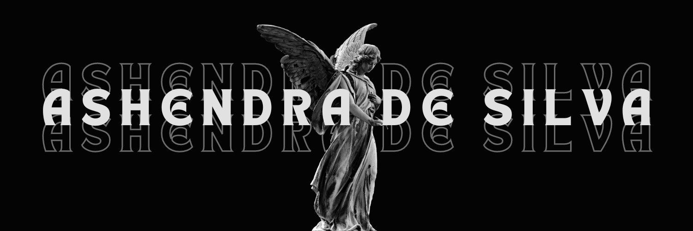

<body></body>
<!--horizontal divider(gradiant)-->

<!--h1 without bottom border-->

  <ul align="center">
    
<h1 style="display: inline-block">Hi 👋, I'm Ashendra de Silva aka Unknown Code by Ashendra</h1>

  </ul>

<!--- snake -->

  

<!--h2 without bottom border-->

  <ul align="center">
    
<h2 style="display: inline-block">Confusion is part of Programming</h2>

  </ul>

<!--Intro start-->
- 🌱 I’m currently studying BSc.(Hons.) Information Technology Specializing in Computer systems & Network Engineering @Sri Lanka Institute od Information Technology(SLIIT) 

- ☁️ I've keen interest in Network Engineering. So, I'm learning...

- 📝 My Portfolio is [Portfolio](https://ashendra.web.app)

- 📫 Feel free to reach me out **unknowncodebyashendra@gmail.com**

- 🏠 Don't hesitate to drop me a **👋** on Discord –  [ashendrade](https://discordapp.com/users/ashendrade) my username!
<!--Intro end-->

<!--- stats & Trophy (start) -->

  <!--- stats (start) -->
<table align="center">
<tr border="none">
<td width="50%" align="center">
  
  
    
   
</td>

<td width="50%" align="center">

  
  
  </td>
</tr>
</table>
<!--- stats (end) -->

<!--- trophy (start) -->

  

<!--- trophy (start) -->

        
<!--- stats (end) -->

<!--h1 without bottom border-->

  <ul align="center">
    
<h2 style="display: inline-block">Technologies That I Know👨🏻‍💻</h2>

  </ul>

<!--tech stack icons-->

  

<!-- Connect with me -->
<!--h2 without bottom border-->

  <ul align="center">
    
<h2 style="display: inline-block">Connect With Me🤝</h2>

  </ul>

<!--icons and links-->

  

<h3 align="left">Support Me:</h3>

  

<!--profile visit count-->

  

  

<!--horizontal divider(gradiant)-->

